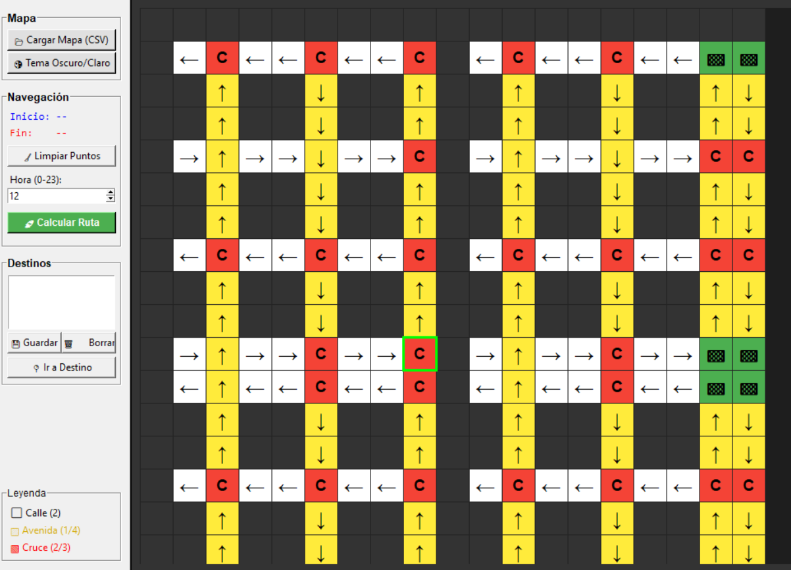

# MiniWaze GUI App

[](https://github.com/Geovanni-Gonzalez/MiniWaze-GUI-App/actions/workflows/ci.yml)

## Descripción
Aplicación gráfica en Python que carga un mapa CSV, gestióna usuarios y calcula rutas sobre un grafo.

## Objetivo
Practicar grafos, algoritmos de rutas e interfaces gráficas aplicadas a navegacion.

## Caso de estudio

### Problema
Un sistema de navegacion necesita representar lugares, conexiones y costos para sugerir rutas utiles. La dificultad esta en pasar de datos tabulares a un grafo navegable y mostrar el resultado de forma comprensible.

### Solución
MiniWaze carga datos desde CSV, construye un modelo de grafo y ofrece una interfaz Tkinter para explorar rutas. El foco del proyecto es conectar estructuras de datos con una experiencia visual simple.

### Arquitectura
- `programa/models/`: entidades y logica de grafo/rutas.
- `programa/ui/`: ventanas, canvas y controles de interaccion.
- `programa/data/`: archivos CSV usados como fuente de datos.
- `tests/`: pruebas de logica para validar comportamiento central.

### Decisiones técnicas destacadas
- Separacion entre dominio, datos y presentacion para facilitar pruebas.
- CSV como formato simple para representar mapa y conexiones.
- Pytest para verificar la logica sin depender de la interfaz grafica.
- CI con compilacion/validacion para detectar errores tempranos.

## Tecnologías utilizadas
- Python
- Tkinter
- CSV
- Grafos
- Pytest

## Funcionalidades principales
- Carga de mapa CSV
- Gestión de usuarios
- Pathfinding
- Canvas gráfico
- Pruebas de lógica

## Mi rol
Desarrollé modelos de grafo, carga de mapa, rutas y ventanas principales.

## Aprendizajes clave
- Grafos
- Datos tabulares
- Modelo/UI
- Pruebas con pytest

## Instalación y ejecución
```bash
cd MiniWaze-GUI-App
python programa/main.py
pytest
```

## Estructura del proyecto
- programa/main.py: entrada
- programa/models/: dominio
- programa/ui/: ventanas
- programa/data/: datos
- tests/: pruebas

## Capturas o demo


## Estado del proyecto
Proyecto académico funcional.

## Valor técnico demostrado
Demuestra estructuras de datos aplicadas a una interfaz visual.

## Mejoras futuras
- Documentar mapa.csv
- Seleccion visual origen/destino
- Mas algoritmos

## Autor
Geovanni González  
Estudiante de Ingeniería en Computación  
GitHub: [Geovanni-Gonzalez](https://github.com/Geovanni-Gonzalez)


